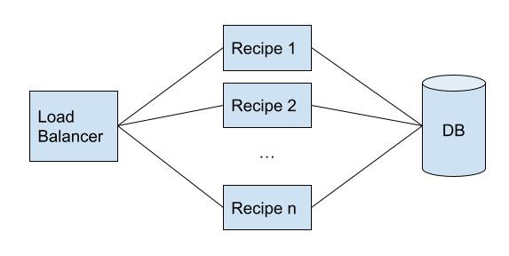

# Deploy\Run Proposal
I tried to make a docker-compose more close to the prod environment as possible.

## Elements

### Load Balancer (Nginx)
Load balancer will receive all the request and share the workload between the nodes of recipe-service we have. 

So in the future if need will be able to deploy several services without a problem.

### Recipe
This is the core of the project, where all logic is. Could be deployed several instances of these so there is no eventual problems with overload.

### DB (MongoDB)
The database can always be scale with sharding and\or replica sets
